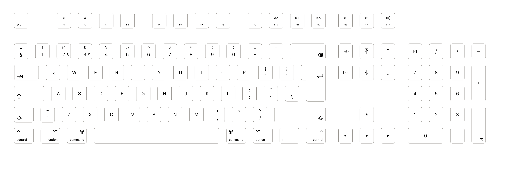
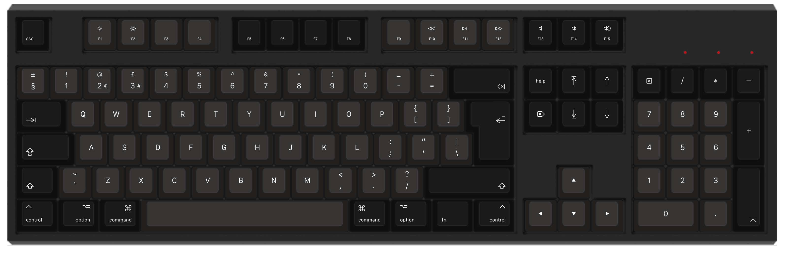
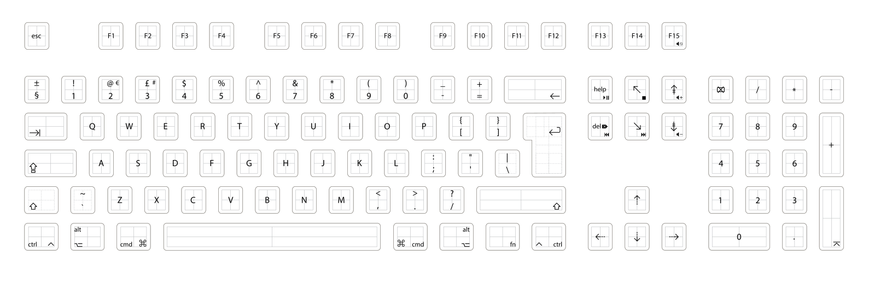

# A UK Mac Keyboard Layout

An SVG layout file for a UK Mac keyboard layout suitable for ordering from WASD keyboards

Includes some extra layers for an alternative function key, media key layout.

## Preview

### 105/88 key

### 62 key

### A1243-style with media keys
Media key placement is based on the default built-in function commands from the  [WASD V2 User Guide](https://www.wasdkeyboards.com/media/v2-user-guide.pdf):

| Function Commands  |               |
| ------------------ |-------------- |
| Fn + Insert/Help | Play/Pause |
| Fn + Delete | Previous Track |
| Fn + End |  Eject |
| Fn + Page Up | Volume Up |
| Fn + Page Down | Volume Down |
| Fn + Pause | Mute |
| Fn + F13 | Eject |

