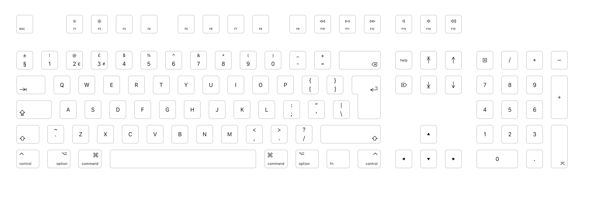
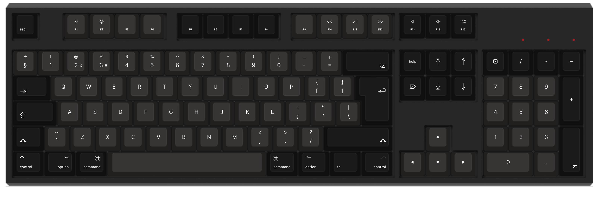

# A UK Mac Keyboard Layout

An SVG layout file for a UK Mac keyboard layout suitable for ordering from WASD keyboards

Includes some extra layers for an alternative function key, media key layout.

## Preview

### 105/88 key

### 62 key

### A1243-style with media keys
Media key placement is based on the default built-in function commands from the  [WASD V2 User Guide](https://www.wasdkeyboards.com/media/v2-user-guide.pdf):

| Function Commands  |               |
| ------------------ |-------------- |
| <kbd>Fn</kbd> + <kbd>Insert/Help</kbd> | Play/Pause |
| <kbd>Fn</kbd> + <kbd>Delete</kbd> | Previous Track |
| <kbd>Fn</kbd> + <kbd>End</kbd> |  Eject |
| <kbd>Fn</kbd> + <kbd>Page Up</kbd> | Volume Up |
| <kbd>Fn</kbd> + <kbd>Page Down</kbd> | Volume Down |
| <kbd>Fn</kbd> + <kbd>Pause</kbd> | Mute |
| <kbd>Fn</kbd> + <kbd>F13</kbd> | Eject |

Note: the stop media key is not supported on OSX so is omitted.

